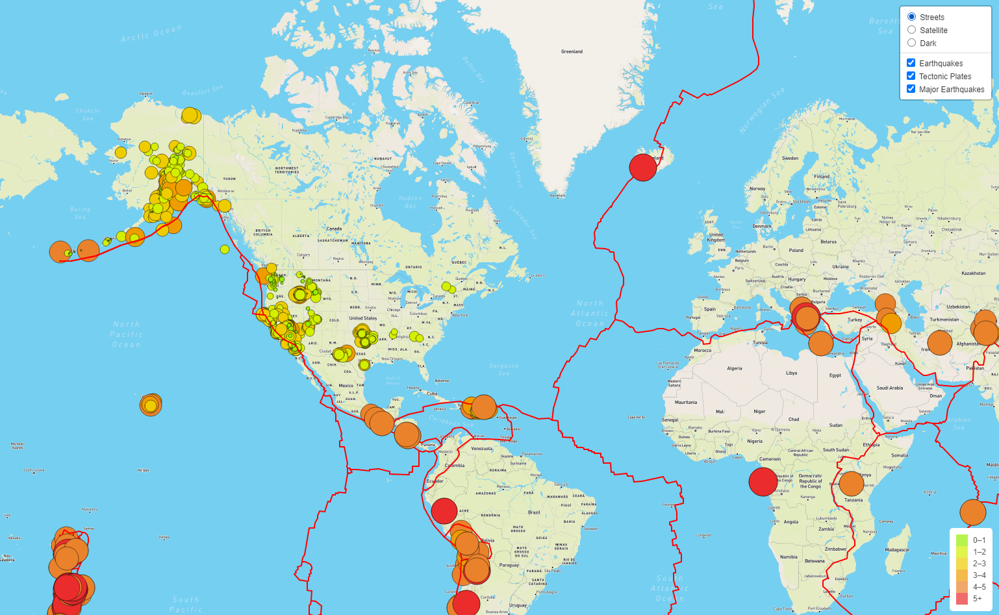
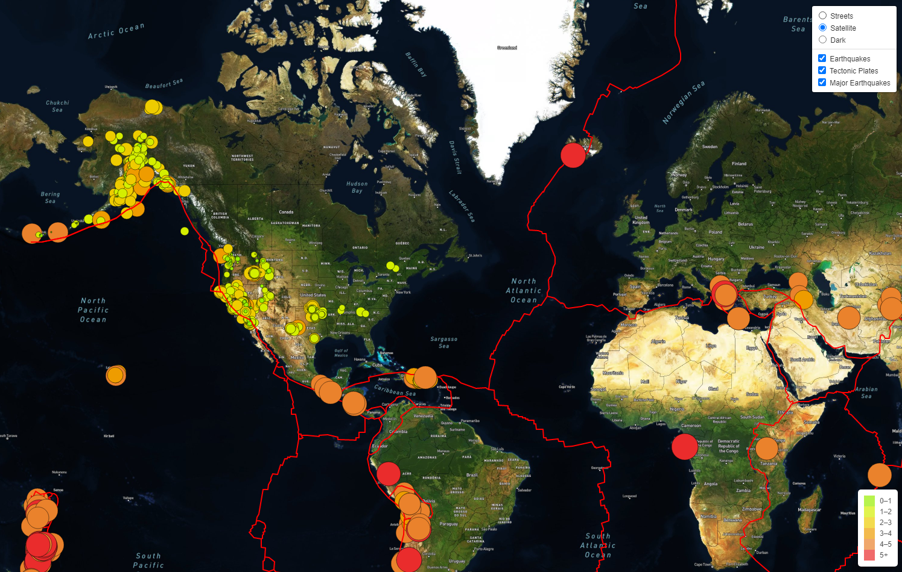
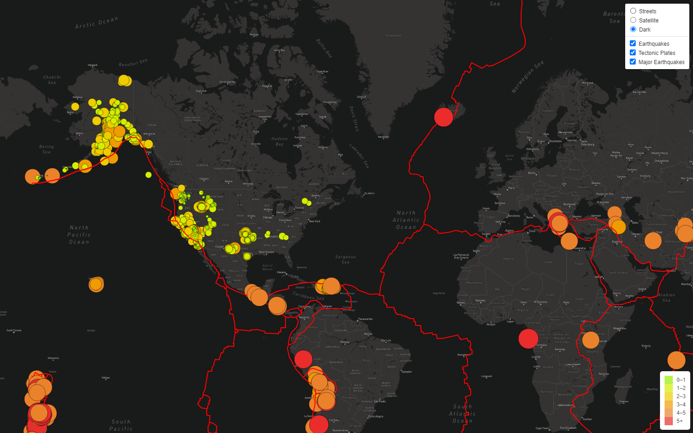

# Mapping_Earthquakes

## Project Overview
We are tasked with building insighful data visualizations with interactive features on earthquakes from around the world. Our goal is to make informative and easy to use maps that support website and moile application development. We will be using the latest earthquake GeoJSON data from the U.S. Geological Survey website. We will traverse and retrieve the earthquake data using JavaScript and the D3 and leaflet libraries and plot the data on a Mapbox amp through an API request. On our map the magnitute and location of each earthquake will be shown in a popup marker. The markers for each earthquake will reflect the magnitude of the earthquake in their size and color. Earthauakes with higher magnitudes will appear larger and darker in color. We will have a leged providing context for our markers. To illustrate the relationship between the location and frequency  of seismic activity and tectonic plates we will add fault lines on the map. We will create multiple tile layers and layer groups for our map. 

## Results
Below are snapshots of the 3 tile layers. 
 
### Street View 

 
### Satellite View

 
### Dark Mode View
